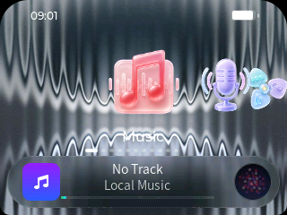

# CrazyPod

CrazyPod is experimental standalone firmware for the iPod Classic 6th
generation. It replaces the Rockbox interface with a 320×240 LVGL application
carousel while retaining Rockbox's codecs, playback engine, storage, power,
USB, and device drivers.



> [!WARNING]
> CrazyPod is experimental firmware. Development builds have been installed
> and file-integrity checked on an iPod Classic 6G, but the project has no
> release-grade installer or complete hardware regression suite. Keep a full
> backup and a tested recovery path.

## Scope

| | Current support |
| --- | --- |
| Device | iPod Classic 6G (`ipod6g`) only |
| Display | 320×240 RGB565 |
| Interface | LVGL 9.5.0; click-wheel navigation |
| Media | Local files only |
| Connectivity | Selectable USB charge-only or mass-storage mode |
| Network services | None |

CrazyPod is a firmware product, not a Rockbox theme. Its build excludes the
Rockbox menu, file browser, WPS, skin engine, theme system, plugin UI, recording
pipeline, USB Audio, HID, and iPod accessory protocol.

## Features

### Music and media

- Recursively scans `/Music` and `/iPod_Control/Music` for formats supported by
  the bundled Rockbox codecs.
- Builds artist, album, song, and M3U/M3U8 playlist views from local metadata.
- Provides search, a dynamic playback queue, shuffle, repeat, resume, album
  art, synchronized local LRC lyrics, and native Cover Flow.
- Keeps the previous artwork visible until the next cover and blurred
  background are ready, then publishes them together.
- Plays podcasts stored under `/Podcasts`.
- Provides a unified **Media** app with Photos, Videos, and Favorites.
- Browses JPG, JPEG, and BMP images under `/Pictures`, with favorites,
  full-screen viewing, zoom, and pan.
- Plays pre-transcoded MPEG-1/2 `.mpg` and `.mpeg` files from `/Videos`, with
  poster art, play/pause, 10-second seek, volume control, and resume.

### Device applications

- **Notes:** drafts, pinning, search, duplication, trash, and restore.
- **Books:** EPUB, TXT, and Markdown reading with progress, bookmarks,
  favorites, chapters, font sizes, and paper themes. TXT and Markdown content
  automatically distinguishes strict UTF-8 from GBK/GB2312 (CP936).
- **Organizer:** local calendar events, read-only ICS import, and VCF contacts.
- **Mini Apps:** signed native Calculator and Pomodoro packages using ABI 1,
  SDK revision 3, CPK format 2 resources, host-owned asynchronous dialogs,
  read-only Now Playing metadata, and a shared click-wheel runtime. Clock, stopwatch, calendar,
  and contacts remain under More Features rather than being duplicated as
  packages.
- **Workouts:** 20 timed activities with pause, resume, history, and summaries.
  CrazyPod records elapsed time only; it does not invent distance, steps, or
  calorie data.
- **System:** live battery and clock status, selectable USB Charge/Data modes,
  and a configurable 16-application main menu.
- **Lock screen:** immediate manual lock, wake-key isolation, a large clock,
  configurable wallpaper and corner radii, and a clockwise 19-step
  wheel-distance unlock with progress and decay.
- **Power menu:** holding Play for about three seconds opens a Shut Down /
  Restart confirmation surface without entering Rockbox's committed shutdown
  path first.
- **Settings:** sound, EQ Studio, display and backlight, Reduce Motion,
  playback, sleep timer, USB charging, click feedback, and main-menu order.

### Mini Apps

The firmware bundles two usable ABI 1 reference packages:

- **Calculator:** a standard calculator that starts at `0` and supports
  chaining, contextual percent, repeat equals, sign, decimal, backspace, clear,
  and error recovery. Play is a direct equals shortcut.
- **Pomodoro:** defaults to 25-minute focus, 5-minute short break, 15-minute
  long break, and four rounds. Durations and rounds are editable; running
  sessions support pause, resume, skip, reset, persisted deadlines, and
  background alarms.

Fast wheel input never skips visible actionable controls. The host keeps a
bounded input queue and consumes at most one discrete focus movement per
display frame; reversing direction discards stale queued movement. Acceleration
is used only while editing a numeric or continuous value, such as Pomodoro
duration. Additional signed packages can be placed in `/MiniApps/Install`; see
[miniapps/README.md](miniapps/README.md) for the package, runtime, and security
contracts, or follow the
[Chinese Mini App tutorial](miniapps/TUTORIAL.zh-CN.md) to create a package
from scratch.

### Appearance

- 16 packaged icon themes with scale, glow, and highlight controls.
- Independent top and bottom screen corner radii.
- Home and menu wallpapers loaded from `/Pictures`.
- Versioned `.upodtheme` appearance presets with validated import and export.
- Music, Media, Notes, and Books use object-specific skeuomorphic preview
  transitions on their first-level menus. Rapid wheel input cancels the
  current transition and presents only the latest selection.
- Preview objects render a complete procedural surface immediately. Album art
  and photo thumbnails are optional inner skins: cached media appears with a
  short fade after the physical entrance, without a spinner or replaying the
  scene. The All Music wall limits media reads to its first row.
- Settings → Display → Reduce Motion replaces transforms and stagger with a
  short crossfade. The preference is stored in CrazyPod's versioned state.

## Build and run

See [BUILD.md](BUILD.md) for toolchain prerequisites and detailed build
options. The scripts have been verified on macOS.

Clone the canonical repository and build the simulator:

```sh
git clone https://github.com/Gigass/CrazyPod.git
cd CrazyPod
./build-sim.sh
cd build-sim
./rockboxui
```

Build the iPod 6G firmware:

```sh
./build-hw.sh
```

Both scripts perform clean builds by default. Pass `--incremental` to reuse an
existing build directory.

| Artifact | Path |
| --- | --- |
| Simulator | `build-sim/rockboxui` |
| Firmware | `build-hw-ipod6g/rockbox.ipod` |
| Install archive | `build-hw-ipod6g/CrazyPod-6G.zip` |
| Optional bootloader | `build-bootloader-ipod6g/bootloader-ipod6g.ipod` |
| Calculator package | `dist/miniapps/calculator-1.2.0.cpk` |
| Pomodoro package | `dist/miniapps/pomodoro-1.2.0.cpk` |

The project does not yet claim a supported hardware installation procedure.
The generated archive is for controlled device testing by users who already
have a compatible bootloader and recovery method.

See [PROJECT_STATUS.md](PROJECT_STATUS.md) for the current validation level,
conversation audit, and known release blockers.

## Device content

Create these directories at the root of the iPod's storage:

| Content | Location |
| --- | --- |
| Music and playlists | `/Music` |
| iTunes-managed music | `/iPod_Control/Music` |
| Podcasts | `/Podcasts` |
| Books | `/Books` |
| Photos and wallpapers | `/Pictures` |
| Videos | `/Videos/*.mpg` or `/Videos/*.mpeg` |
| Contacts | `/Contacts/*.vcf` |
| Calendars | `/Calendars/*.ics` or `/Calendar/*.ics` |
| Mini App packages | `/MiniApps/Install/*.cpk` |
| Theme import | `/.crazypod/import.upodtheme` |

CrazyPod stores settings, notes, reading progress, workout history, caches, and
exported appearances under `/.crazypod`.

Video files must already be MPEG-1/2 program streams. Convert a desktop video
and generate its same-basename 128×96 BMP poster with:

```sh
./tools/convert-crazypod-video.sh input.mp4
```

The default output is `Videos/input.mpg` plus `Videos/input.bmp`; copy both
files into `/Videos` on the iPod. Pass a directory as the second argument to
choose another output location.

## Controls

| Action | iPod | Simulator |
| --- | --- | --- |
| Move focus | Click wheel | Up / Down |
| Open | Select | Return |
| Back | Menu | Backspace / Escape |
| Previous / Next | Left / Right | Left / Right |
| Play | Play | Space |

On the iPod, hold Play for about three seconds to open the power menu. Use the
wheel or Left/Right to choose Shut Down or Restart, Select to confirm, and Menu
to cancel.

During video playback, Play toggles pause, Left/Right seek by 10 seconds, the
wheel changes volume, and Menu exits while saving resume progress.

## Known limits

- Only the iPod Classic 6G target is supported.
- Music, lyrics, books, photos, contacts, and calendars are local-only.
- Video playback does not accept MP4/H.264/AAC directly. Convert those files
  to MPEG-1/2 first; subtitles, playlists, deletion, and on-device conversion
  are not included in the first video release.
- Books detects strict UTF-8 and CP936-compatible GBK/GB2312 text. It does not
  decode GB18030 four-byte extensions, and uncommon characters outside the
  bundled font subset may appear blank.
- Camera and voice recording are absent because the target has neither
  required input.
- Mini Apps accepts the restricted, signed native `.cpk` format documented in
  [miniapps/README.md](miniapps/README.md). Ed25519 signing verifies package
  origin and integrity; it is not a sandbox. An installed native Mini App runs
  with firmware privileges.
- The repository's Mini App signing key is a public development key. Replace
  the trusted public key and keep the matching private key outside the
  repository before distributing production packages.
- The optional custom bootloader is built and installed separately from the
  firmware archive. It has not completed physical boot regression. Its current
  Apple-shaped mark is also unsuitable for an unaffiliated public release
  without a trademark review or replacement artwork.
- Rockbox plugins, WPS, skins, themes, USB Audio, HID, and iPod accessory
  protocol are excluded from the product package.

## Project structure

- `apps/crazypod/` contains the product UI, applications, playback bridge, and
  persistent state.
- `miniapps/` contains the native Mini App SDK, Calculator, Pomodoro, package
  manifests, development key, and host tests.
- `lib/lvgl/` contains the vendored LVGL 9.5.0 source.
- `assets/crazypod/` and `assets/crazypod-icons/` contain packaged runtime
  graphics.
- `tools/convert-crazypod-video.sh` creates device-ready MPEG video and poster
  pairs with FFmpeg.
- `build-bootloader.sh` builds the optional silent boot surface but never
  writes it to a device.
- `firmware/`, `lib/rbcodec/`, and the remaining inherited Rockbox tree provide
  the iPod 6G platform.

See [release-notes.md](release-notes.md) for the current feature delta and
[PROJECT_STATUS.md](PROJECT_STATUS.md) for validation details. Read
[CONTRIBUTING.md](CONTRIBUTING.md) before submitting changes.

## License

CrazyPod preserves the upstream Rockbox and Rockpod copyright notices and is
distributed under GPLv2. See [LICENSE](LICENSE) and [NOTICE](NOTICE). CrazyPod
is not affiliated with or endorsed by Apple Inc.
